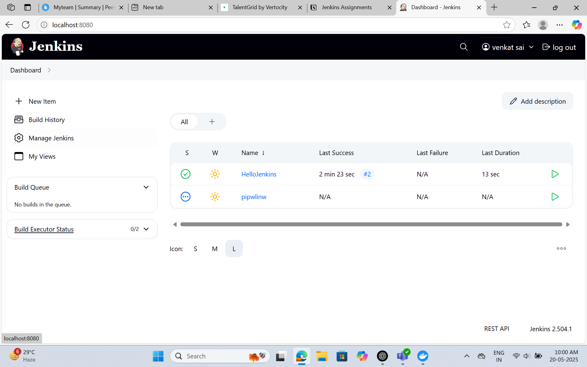
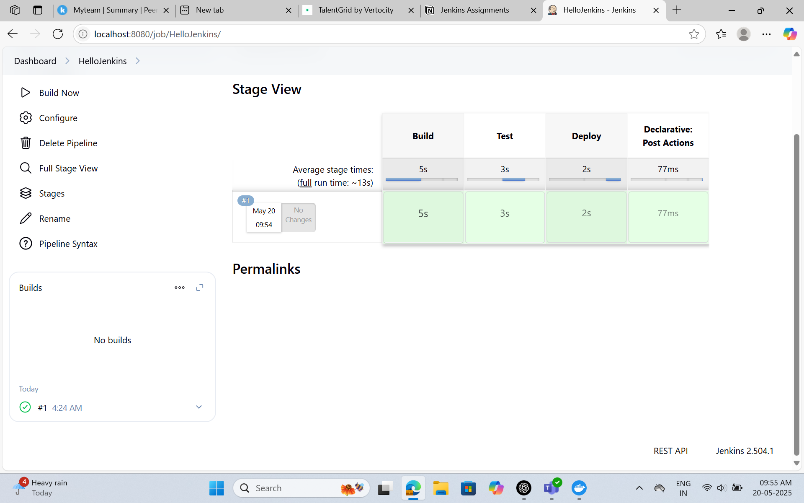
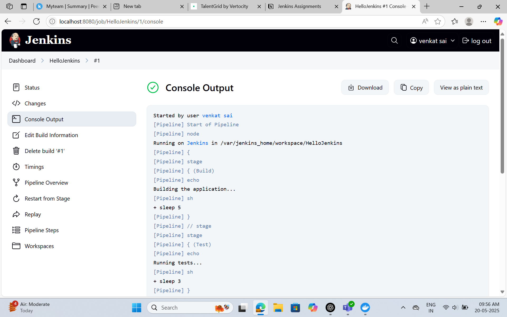
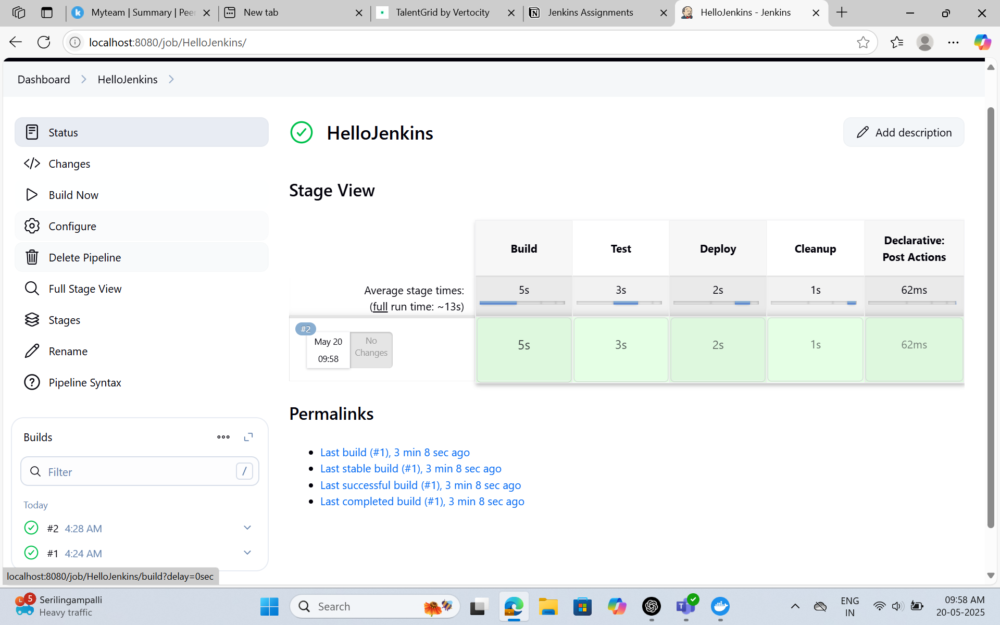
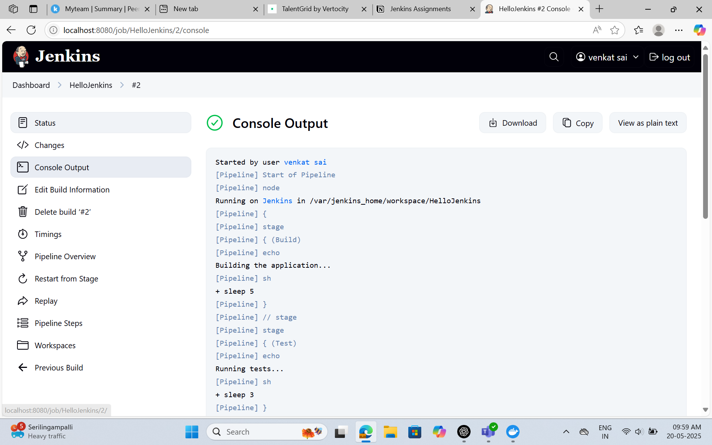

##  Jenkins Dashboard

This screenshot shows the main Jenkins dashboard, including job listings, build queue, and executor status.

## First Pipeline Execution

###  Stage View

This visualizes the execution of the initial pipeline with three stages: Build, Test, and Deploy.

### Console Output

This contains the logs of the first pipeline execution.

##  Second Pipeline Execution (After Adding Cleanup Stage)

###  Stage View (Updated)

This updated view includes the new "Cleanup" stage in the pipeline.

###  Console Output (Updated)

Logs from the second pipeline execution including the Cleanup stage.

##  Summary

I learned how to navigate the Jenkins dashboard, where I can view all jobs, the build queue, and executor status. The interface makes it easy to access individual jobs and monitor their progress. I also explored how to view build history and check logs through the Console Output. Overall, Jenkins provides a clear and organized way to manage and monitor automated builds.